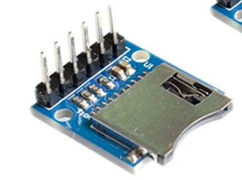

# sdcard

Convenience functions for working with SDCards in Toit.

Common use:

```toit
  main:
    sd := SDCard.from-default
    sd.print-contents
```
Should print the contents of the sd card like:
```
  /sd:
    hello.txt
    slashonly
    noslash
    itermediatedir
        |__>finaldir
    Toit
        |__>creatednew2.txt
        |__>fromtoit.txt
        |__>creatednew.txt
        |__>Folder In Toit
            |__>fromtoit.txt
    Micropython
        |__>testfile.txt
        |__>testfile1.txt
        |__>testfile2.txt
        |__>testfile3.txt
        |__>testlog.bin
        |__>writein
        |__>210218_2.bin
        |__>210218_3.bin
        |__>210218_24bar.bin
        |__>210218_log.bin
    timestream10Text.txt
 ```

## Reading and Writing

To read a file you can use ```SDCard.read path``` to ready raw bytes, or ```SDCard.read-str path``` if you want to read directly to a string.

Writing can be done using ```SDCard.write data path``` if you want to create or overwrite a file or ```SDCard.append data path``` if you want to append
an existing file.

A note on sd card breakout boards:

I have not had luck with breakout boards that have any level shifting functionality. I have gotten this to work by soldering directly to
a microSD to full size SD adapter and by using a breakout board like this:



Random Nerd Tutorials has a great diagram of the wiring available at [Random Nerd Tutorials ESP32 SD Card Tutorial](https://randomnerdtutorials.com/esp32-microsd-card-arduino/)
Image from that link:


